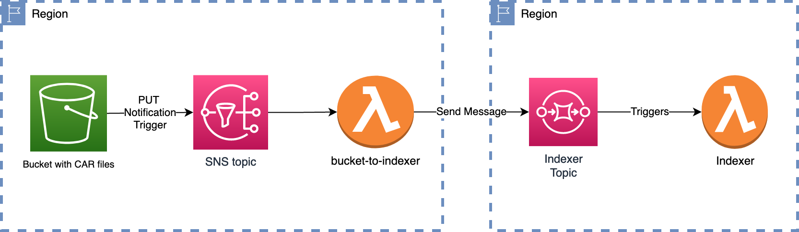

# IPFS Elastic Provider - Bucket to Indexer

The purpose of this component is to notify indexer subsystem of the existence of a new object in a S3 bucket. It receives a PUT notification trigger, transforms it into a message with the expected format and sends it to the indexer SQS topic.

This lambda can be triggered by any S3 buckets within the same region it was deployed. It also can be deployed in multiple regions.

## Deployment environment variables

_Variables in bold are required._

| Name                        | Default            | Description                                                                    |
| --------------------------- | ------------------ | ------------------------------------------------------------------------------ |
| SQS_INDEXER_QUEUE_URL       | indexerQueue       | The SQS topic to publish message to indexing subsystem                         |
